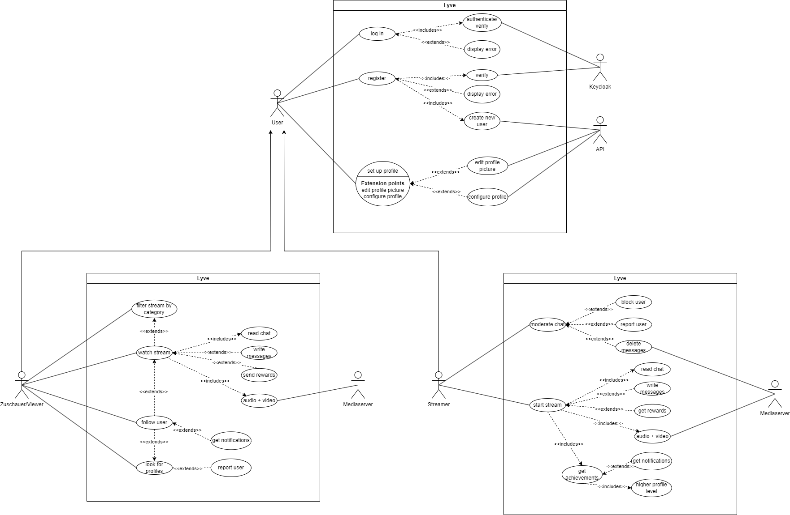
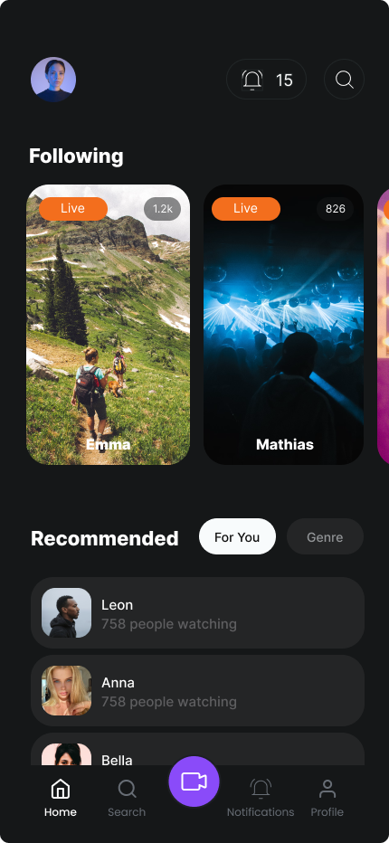

# Lyve

(ausgesprochen Live)

### 0 Autoren

Jan-Niklas Rau

Louis-Kaan Ay

[https://github.com/Louis3797/Lyve](https://github.com/Louis3797/Lyve)

# 1 Einführung

Lyve ist eine Livestreaming-Plattform in der User livestreamen oder Livestreams schauen können. Viewer können mit den Streamer per Chat interagieren und sogennante Rewards an diesen senden. Das erreichen bestimmter Meilensteine (Achievments) führt dazu das Streamer mehr auf der Plattform promoted werden und so an Sichtbarkeit und ansehen gewinnen.

---

---

# 2 Anforderungen

## 2.1 Stakeholder

### Persona

| Name   | Alter | Geschlecht | Beruf                 | Interessen                                  | Nutzung von Lyve                                                                           | Ziele und Motivation                                                                                        |
| ------ | ----- | ---------- | --------------------- | ------------------------------------------- | ------------------------------------------------------------------------------------------ | ----------------------------------------------------------------------------------------------------------- |
| Sarah  | 22    | Weiblich   | Studentin             | Mode, Kunst, Lifestyle                      | Teilt Outfit-Ideen, Make-up-Tutorials, Lifestyle-Tipps mit der Community                   | Reichweite vergrößern, Gleichgesinnte finden, kreative Inhalte teilen                                       |
| Max    | 28    | Männlich   | Grafikdesigner        | Fotografie, Design, visuelle Ästhetik       | Veranstaltet Live-Fotografie-Touren, teilt Tipps zur Fotografie                            | Fachwissen teilen, Inspiration erhalten                                                                     |
| Lena   | 20    | Weiblich   | Fitness-Enthusiast    | Workouts, gesunde Ernährung                 | Bietet Live-Workouts an, gibt Ernährungstipps, teilt ihre Fitnessreise                     | Unterstützende Fitness-Community aufbauen, Menschen zu einem gesünderen Lebensstil inspirieren              |
| Jonas  | 24    | Männlich   | Musikproduzent        | Elektronische Musik, DJing                  | Streamt Live-DJ-Sets, präsentiert neue Tracks, interagiert mit Fans                        | Musik teilen, Fanbase aufbauen                                                                              |
| Sophie | 18    | Weiblich   | Abiturientin          | Modedesign, Styling                         | Veranstaltet Live-Modenschauen, stellt ihre Designs vor, erhält Feedback von der Community | Kreative Fähigkeiten weiterentwickeln, sich mit Modeinteressierten austauschen                              |
| Tim    | 30    | Männlich   | Softwareentwickler    | Technologie, Gadgets, Innovationen          | Teilt Live-Reviews von Gadgets, Software-Updates und technischen Lösungen                  | Fachwissen teilen, Feedback erhalten, sich mit anderen Tech-Begeisterten vernetzen                          |
| Laura  | 26    | Weiblich   | Reisebloggerin        | Reisen, Kulturen, Abenteuer                 | Bietet Live-Reiseberichte, gibt Tipps für unterwegs, veranstaltet virtuelle Reiseführungen | Reiseerfahrungen teilen, Menschen inspirieren, eine globale Reisecommunity aufbauen                         |
| David  | 32    | Männlich   | Koch                  | Kochen, Backen, kulinarische Experimente    | Veranstaltet Live-Kochkurse, demonstriert Rezepte, bietet kulinarische Events              | Leidenschaft für gutes Essen teilen, Tipps und Tricks weitergeben, eine lebendige Food-Community aufbauen   |
| Julia  | 21    | Weiblich   | Psychologie-Studentin | Persönliche Entwicklung, mentale Gesundheit | Bietet Live-Coachings, Meditationssitzungen, gibt Tipps für Stressbewältigung              | Menschen helfen, ihre mentale Gesundheit zu stärken, Unterstützung finden, eine positive Community aufbauen |
| Felix  | 29    | Männlich   | DIY-Enthusiast        | Kreative Projekte, Heimwerken               | Veranstaltet Live-DIY-Workshops, teilt Bauanleitungen, gibt Tipps für Heimwerkerprojekte   | Handwerkliche Fähigkeiten teilen, Inspiration bieten, eine Community von Heimwerkern aufbauen               |
| Emma   | 17    | Weiblich   | Schülerin             | Unterhaltung, Lifestyle                     | Schaut Live-Modenschauen, verfolgt Live-Kochkurse, nimmt an Live-Workouts teil             | Unterhaltung finden, Inspiration für den eigenen Lebensstil erhalten                                        |
| Oliver | 16    | Männlich   | Schüler               | Technologie, Gaming                         | Verfolgt Live-Reviews von Gadgets, schaut Live-DJ-Sets, nimmt an Live-Workshops teil       | Neueste Technologien entdecken, Unterhaltung finden, Fachwissen in IT und Gaming erweitern                  |
| Lara   | 18    | Weiblich   | Schülerin             | Kochen, DIY-Projekte                        | Schaut Live-Kochkurse, nimmt an Live-DIY-Workshops teil, verfolgt Live-Modenschauen        | Neue Rezepte kennenlernen, Inspiration für DIY-Projekte finden, Unterhaltung in ihrer Freizeit genießen     |

### Zusammenfassung zu Stakeholdern

| Stakeholder      | Beschreibung                                                                                                                                                                                               |
| ---------------- | ---------------------------------------------------------------------------------------------------------------------------------------------------------------------------------------------------------- |
| Streamer         | Personen, die Inhalte live über die Lyve-Plattform streamen. Sie können ihre Leidenschaften, Fähigkeiten und Interessen teilen und eine Community aufbauen.                                                |
| Zuschauer/Viewer | Personen, die die Live-Streams auf der Lyve-Plattform anschauen. Sie suchen nach Unterhaltung, Inspiration, Lernmöglichkeiten oder Gemeinschaft und interagieren mit den Streamern und anderen Zuschauern. |

## 2.2 Funktionale Anforderungen

Akteure: User (Viewer/Streamer), Keycloak, API, Mediaserver

## 2.3 Nicht-funktionale Anforderungen

### 2.3.1 Rahmenbedingungen

1. **Protokolle und Schnittstellen:** Die App sollte gängige Protokolle und Schnittstellen für die Kommunikation mit anderen Systemen verwenden, z. B. HTTP/HTTPS für die Kommunikation mit Servern, JSON für den Datenaustausch und OAuth für die Authentifizierung.

**Hardware-Anforderungen:** Die App sollte auf einer breiten Palette von mobilen Geräten und Betriebssystemversionen laufen

### 2.3.2 Betriebsbedingungen

- Die App sollte für iOS und Android Smartphones verfügbar sein
- Livestreams sollten flüssig übertragen werden
- Das App Design sollte eine Vielzahl an Bildschirmgrößen unterstützen
- Das Benutzen der App sollte schnell sein.
  - Keine langen Ladezeiten
- Die App sollte die Datenschutzbestimmungen einhalten und sicherstellen
- Die Sicherheit der Benutzerdaten und der Plattform als Ganzes sollte oberste Priorität haben. Es sollten angemessene Sicherheitsmaßnahmen implementiert werden, um Datenlecks, Hacking-Versuche und andere Sicherheitsbedrohungen zu verhindern.
- Die App sollte eine hohe Verfügbarkeit aufweisen

### 2.3.3 Qualitätsmerkmale

| Qualitätsmerkmal       | sehr gut | gut | normal | nicht relevant |
| ---------------------- | -------- | --- | ------ | -------------- |
| Zuverlässigkeit        |          |     |        |                |
| Fehlertoleranz         | X        | -   | -      | -              |
| Wiederherstellbarkeit  | X        | -   | -      | -              |
| Ordnungsmäßigkeit      | X        | -   | -      | -              |
| Richtigkeit            | X        | -   | -      | -              |
| Konformität            | -        | X   | -      | -              |
| Benutzerfreundlichkeit |          |     |        |                |
| Installierbarkeit      | -        | -   | X      | -              |
| Verständlichkeit       | X        | -   | -      | -              |
| Erlernbarkeit          | -        | X   | -      | -              |
| Bedienbarkeit          | X        | -   | -      | -              |
| Performance            |          |     |        |                |
| Zeitverhalten          | X        | -   | -      | -              |
| Effizienz              | -        | X   | -      | -              |
| Sicherheit             |          |     |        |                |
| Analysierbarkeit       | -        | -   | X      | -              |
| Modifizierbarkeit      | -        | -   | -      | X              |
| Stabilität             | X        | -   | -      | -              |

## 2.4 Grafische Benuzter Oberfläche (GUI)

### Mobile

- **Login**
- **Register**
- **Passwort vergessen**
- **Home Page**
  
- **Search Page**
- **Stream**
  - **Sicht Viewer**
    
  - **Sicht Streamer**
- **Profile**
  - **Eigenes Profil**
  - **Anderes Profil**
  - **Statistiken**
  - **Achievements**
- **Einstellungen**
- **Push Notifications**

## 2.5 Anforderungen im Detail

| Als       | möchte ich                                                                                         | so dass                                                           | Akzeptanz                                                                                                                                                                                                                                                                  | Priorität |
| --------- | -------------------------------------------------------------------------------------------------- | ----------------------------------------------------------------- | -------------------------------------------------------------------------------------------------------------------------------------------------------------------------------------------------------------------------------------------------------------------------- | --------- |
| Streamer  | Livestreams erstellen können                                                                       | Man ein Puplikum erreichen kann                                   | Benutzer der App können per Smartphone Kamera Livestreams erstellen, die dann auf der App angezeigt werden und von anderen Benutzern live mitangeschaut werden können                                                                                                      | must      |
| Streamer  | Rewards von meinen Zuschauern erhalten können                                                      | Meine Arbeit geschätzt wird und ich meine Streams verbessern kann | Zuschauer können virtuelle Belohnungen kaufen und an den Streamer senden, wobei eine Auswahl an Belohnungsoptionen verfügbar ist. Der Streamer erhält eine Echtzeitbenachrichtigung über jede erhaltene Belohnung.                                                         | should    |
| Zuschauer | Livestreams nach Kategorien filtern können                                                         | Man schnell Inhalte finden, die mich interessieren                | Die Lyve-Plattform bietet eine Filteroption, mit der Zuschauer Live-Streams nach verschiedenen Kategorien wie Mode, Musik, Fitness usw. sortieren können. Die Filterfunktion ist benutzerfreundlich und ermöglicht eine schnelle Navigation durch die verfügbaren Inhalte. | should    |
| Zuschauer | Benachrichtigungen über gestartete Live-Streams erhalten können dessen Streamer ich abonniert habe | Keine wichtigen Inhalte verpasse                                  | Zuschauer können Benachrichtigungen aktivieren, um über Live-Streams ihrer bevorzugten Streamer informiert zu werden. Die Benachrichtigungen werden rechtzeitig zum Start des Live-Streams gesendet.                                                                       | could     |
| Zuschauer | Während eines Live-Streams Fragen stellen können                                                   | mit dem Streamer interagieren kann                                | Ein Live-Chat-Fenster ist während des Live-Streams verfügbar, das es den Zuschauern ermöglicht, Fragen zu stellen und Kommentare zu hinterlassen.                                                                                                                          | must      |
| Böswilliger Benutzer
(Zuschauer) | Den Live-Chat mit Spam-Nachrichten überfluten können | Die Kommunikation zwischen Streamer und Zuschauern gestört wird | Spam-Nachrichten werden vom Live-Chat erkannt und blockiert | should |
| Streamer | Achievements von der App erhalten | Der Streamer mit vielen Achievements werden von der App promoted | Streamer können Meilensteine wie z.B. eine gewisse Zuschauer Anzahl erreichen und werden von der App dafür Belohnt. Achievements sind von Zuschauern und Streamer einsehbar. Je mehr Achievements ein Streamer hat desto mehr wird dieser Auf der App promoted | must |
| Zuschauer | Streamer abonnieren können | Zuschauer über Aktivitäten und Live-Streams des Streamers auf dem Laufenden bleiben kann | Zuschauer können Streamer abonnieren und erhalten Benachrichtigungen über neue Live-Streams ihrer abonnierten Streamer.
Die Abonnementverwaltung ermöglicht es den Zuschauern, ihre Abonnements zu verwalten. | must |
| Böswilliger Benutzer
(Streamer) | Unangemessene Inhalte in Live-Streams zeigen | Die Richtlinien der Lyve Plattform gebrochen werden | Zuschauer können unangemessene Streams melden, sodass das System Maßnahmen gegen den Streamer und den Stream treffen kann | could |
| Böswilliger Benutzer
(Zuschauer) | Streams melden die nicht gegen die Plattform Richtlinien verstoßen | Livestreams von Streamern unterbrochen werden oder Streamer gesperrt werden | Die Moderation von gemeldeten Streams sollte erkennen ob der Stream wirklich unangemessen ist.
Eine Gruppe von Zuschauern die einen Stream immer wieder unangemessen melden sollte nicht dazu führen das ein Stream unterbrochen wird und dessen Streamer gesperrt wird | could / wont |
| Böswilliger Benutzer | Viele Fake Accounts erstellen | Livestreams oder die Plattform mit Fakenutzern geflutet | Erstellte Benutzerkonten sollten per Email oder SMS verifiziert werden
Nur verifizierte Konten können auf die Plattform zugreifen | should |
| Fontend-Entwickler | Benutzerfreundliche Oberfläche | Benutzer der App sollen eine angenehme und intuitive Erfahrung haben | Die Benutzeroberfläche sollte klare Navigation, konsistente Designelemente und eine ansprechende visuelle Darstellung aufweisen. | must |
| Frontend-Entwickler | optimiertes App-Design für verschiedene Bildschirmgrößen | Benutzer sollen unabhängig von ihrem Gerät eine konsistente Erfahrung haben | Die UI-Elemente sollten dynamisch skalierbar sein und sich automatisch anpassen, um eine optimale Darstellung auf allen Geräten zu gewährleisten. | must |
| Benutzer | Nach Profilen suchen können | ich die Profile anderer erkunden und abonnieren kann | Die App Verfügt über eine Suchfunktion mit der man nach Profilen suchen kann | should |

## Feature Zusammenfassung

- Livestreaming
- Live Chat in Livestreams
  - Spam Detektion (optional)
- Livestreams können nach Kategorie gefiltert werden
- Benachrichtigungen/Notifications (optional)
- Zuschauer können Rewards an Streamer senden
  - Rewards müssen von den Usern mit Echtgeld gekauft werden (optional)
- Streamer erhalten Achievements für das erreichen von Meilensteinen
  - Achievements führen zu mehr Reichweite
- Streamer und Zuschauer können sich gegeneinander abonnieren
- Unangemessene Inhalte können von den Benutzern gemeldet werden (optional)
- Account Email Verification

# 3 Technische Beschreibung

## 3.1 Systemübersicht

## 3.2 Softwarearchitektur

## 3.2.1 Technologieauswahl

**Autorisierung und Authentifizierung:**

- Keycloak
  - OpenID Connect
  - JWT (JSON-Web-Token) + Refresh Token Rotation

**Frontend (Mobile)**

- Programmiersprache
  - Typescript
- Frameworks:
  - React Native
  - Expo
- CSS Framework
  - NativeWind (TailwindCSS)
- Protokolle
  - REST
  - Websocket
  - WebRTC

**Backend (API)**

- Programmiersprache
  - Typescript
- Frameworks:
  - Express.js
  - Socket.io
- ORM
  - Prisma
- Protokolle
  - Websocket → LiveChat + Notifications
  - REST → API Calls (Create User)
  - AMQP → Signaling für den Media Server
- Datenformate
  - JSON

**Backend (Media Server)**

- Programmiersprache
  - Typescript
- Framework:
  - Express.js
- Library:
  - Mediasoup
- Protokolle
  - WebRTC
  - AMQP (fürs Signaling)
- Datenformate
  - JSON

**Event basierte Kommunikation**

- API → Media Server:
  - RabbitMQ

**Datenbank**

- MySQL
- Redis (Cache)

## 3.3 Schnittstellen

Siehe [API Dokumentation](https://github.com/Louis3797/Lyve/blob/main/documentation/api.md)

### 3.3.1 Ereignisse

**RabbitMQ (erstmal nur gedanklich)**

- API → Media-Server
  - get-capabilities →
  - create-stream → Erstellt Stream Router
  - destroy-stream → Entfernt den mediasoup Router
  - join-as-viewer → Viewer zum Stream hinzufügen + Anfrage nach WebRTC Infos
  - remove-viewer → Viewer vom Stream entfernen
  - join-as-streamer → Streamer zum Stream hinzufügen + Anfrage nach WebRTC Infos
  - remove-streamer → Streamer von Stream entfernen + Stream beenden
- Media-Server → API
  - you-joined-as-viewer → Sendet WebRTC Info

## 3.4 Datenmodell

## 3.5 Abläufe

- [ ] Todo Sequenzdiagram Verbindung zum Livestream
- [ ] Todo Sequenzdiagram Erstellung vom Livestream
- [ ] Todo Sequenzdiagram Authentifizierung
- [ ] Todo Sequenzdiagram Account erstellen
- [ ] Todo Sequenzdiagram Reward geben
- [ ] Todo Sequenzdiagram LiveChat

## 3.6 Entwurf

## 3.7 Fehlerbehandlung

## 3.8 Validierung

- Integration Tests für die API sind geplant

# 4 Projektorganisation

## 4.1 Annahmen

- App/Mobile
  - Typescript
  - React Native + Expo
  - Kommunikation mit dem Backend per:
    - REST → HTTP
    - WebRTC
    - Websocket
- Monorepo Projektaufbau (yarn Workspaces)
- IOS und Android App
- Alle Server und oder Services haben ein Docker Image
- Docker Compose wird genutzt als Entwicklungsumgebung
- Backend und Frontend sollen mit der späteren Scalability im Hinterkopf entwickelt werden

## 4.2 Verantwortlichkeit

### Rollen

| Name           | Rolle                                                                        |
| -------------- | ---------------------------------------------------------------------------- |
| Louis-Kaan Ay  | Softwarearchitekt   Frontend- & Backend Entwickler   DevOps Engineer |
| Jan-Niklas Rau | Frontend- & Backend Entwickler  UI/UX Designer                           |

## 4.3 Grober Projektplan

### Meilensteine

- [ ] Spezifikation abgeben 03.05
- [ ] MVP App Gui
- [ ] Authentifizierung
- [ ] Livestreams implementieren
- [ ] LiveChat implementation
- [ ] Achievement System
- [ ] MVP Fertig stellen
- [ ] MVP vorstellung ~Ende Mai

fertiges Produkt

fertige Praesentation

# 5 Anhänge

### 5.1 Glossar

**Mediasoup**

**RTP**

Real-Time-Transport

**Peer**

Ein Peer ist eine Entität in einem WebRTC-Netzwerk, die eine Verbindung zu einem mediasoup-Router herstellt. Ein Peer kann Audio- und Videodaten produzieren und konsumieren und mit anderen Peers kommunizieren.

**Pipe**

Eine Pipe ist eine Verbindung zwischen einem Producer und einem Consumer in mediasoup. Sie ermöglicht den Transport von Audio- oder Videodaten vom Producer zum Consumer über den mediasoup-Router.

**Worker**

Ein Worker stellt einen mediasoup C++-Unterprozess dar, der auf einem einzigen CPU-Kern läuft. Ein Worker kann viele Router handhaben.

**Router**

Ein Router enthält Producer’s und Consumer’s, die Audio/Video RTP zwischen ihnen austauschen. In bestimmten Anwendungsfällen kann ein Router als "Mehrparteien-Konferenzraum" verstanden werden.

**Consumer**

Ein Consumer ist ein Endpunkt für Audio- oder Videodaten in mediasoup. Ein Consumer ist mit einem Producer verbunden und empfängt die vom Producer bereitgestellten Medienströme.

**Producer**

Ein Producer ist eine Quelle für Audio- oder Videodaten in mediasoup

**SFU (Selective Forwarding Unit)**

Eine SFU ist ein Bestandteil eines WebRTC-Netzwerks, der dazu dient, Medienströme von einem Sender an mehrere Empfänger weiterzuleiten. Anders als bei einem traditionellen Videokonferenz-Setup, bei dem alle Teilnehmer alle Medienströme empfangen, entscheidet die SFU, welche Medienströme an welche Teilnehmer gesendet werden. Dadurch kann die Bandbreitennutzung optimiert werden, insbesondere in großen Konferenzen.

**WebRTC**

WebRTC steht für "Web Real-Time Communication" und ist ein offener Standard, der es ermöglicht, Echtzeitkommunikation direkt im Webbrowser ohne Plugins oder zusätzliche Software zu realisieren. WebRTC umfasst verschiedene Technologien, darunter die Übertragung von Audio- und Videodaten sowie den Austausch von Daten (Data Channels) in Echtzeit.

**Keycloak**

Keycloak ist ein Open-Source-Softwareprodukt, das Single Sign-On mit Identitäts- und Zugriffsmanagement für moderne Anwendungen und Dienste ermöglicht

**OAuth**

OAuth 2.0 steht für „Open Authorization“ und ist ein Standard, mithilfe dessen eine Website oder Anwendung auf Ressourcen zugreifen kann, die von anderen Web-Apps für einen Nutzer gehostet werden

**OpenID Connect**

OpenID Connect oder OIDC ist ein Identitätsprotokoll, das die Autorisierungs- und Authentifizierungsmechanismen von OAuth 2.0 nutzt

**Streamer**

Ein Streamer ist ein User der Livestreams produziert

**Viewer**

Ein Viewer ist ein User der Livestreams konsumiert

### 5.2 Referenzen

- [DSGVO](https://dsgvo-gesetz.de/)
- [https://mediasoup.org/](https://mediasoup.org/)
- [https://www.keycloak.org/](https://www.keycloak.org/)
- [https://auth0.com/de/intro-to-iam/what-is-oauth-2](https://auth0.com/de/intro-to-iam/what-is-oauth-2)
- [https://www.prisma.io/](https://www.prisma.io/)
- [https://expo.dev/](https://expo.dev/)
- [https://www.rabbitmq.com/](https://www.rabbitmq.com/)
- [https://www.typescriptlang.org/](https://www.typescriptlang.org/)
- [https://expressjs.com/de/](https://expressjs.com/de/)
- [https://react.dev/](https://react.dev/)
- [https://tailwindcss.com/](https://tailwindcss.com/)
- [https://socket.io/](https://socket.io/)
- [https://webrtc.org/?hl=de](https://webrtc.org/?hl=de)
- [https://reactnative.dev/](https://reactnative.dev/)

### 5.3 Index
